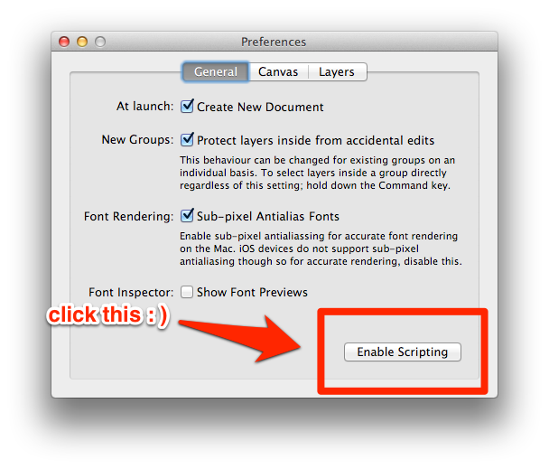
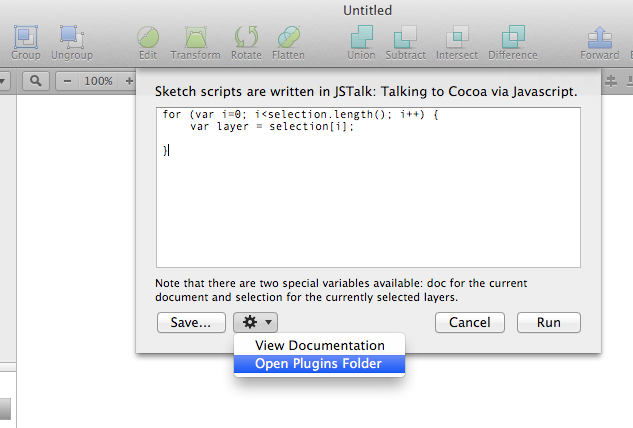

# Sketch Commands

This will (eventually) be a port of my [Orange Commands](http://orangecommands.com) for Bohemian Coding’s [Sketch.app](http://bohemiancoding.com/sketch/).

## Installation

1. You'll need at least version 2.1, and you have to **enable scripting in preferences**:

    

    Beware, though: I like to use the latest [Sketch beta](http://www.bohemiancoding.com/sketch/beta/) for development, so some things might not work as expected.

2. [Download the ZIP file with the commands](https://github.com/bomberstudios/sketch-commands/archive/master.zip)
3. Copy the contents of the ZIP to `~/Library/Application Support/sketch/Plugins` (you can get access to that folder by opening the Plugins menu, choosing "Custom Script..." and then clicking in the gear icon and choosing "Open Plugins Folder")

    

## More info

If you are curious about scripting Sketch, here's a link to the official [Sketch Scripting API documentation](http://bohemiancoding.com/sketch/scripting/).

## Thanks

Huge props to Bohemian Coding (and specially Pieter Omvlee) for their collaboration on making the scripting API a reality.